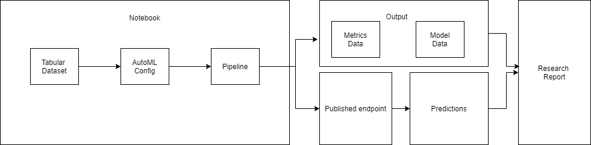
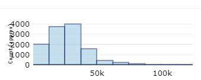
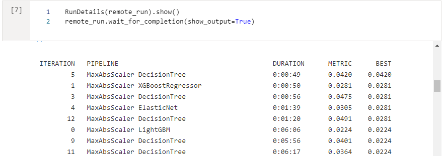
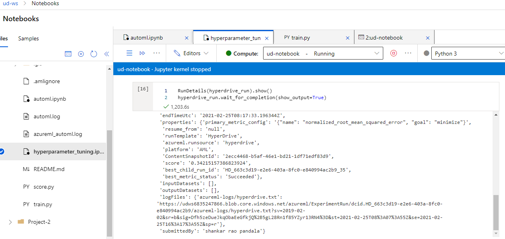
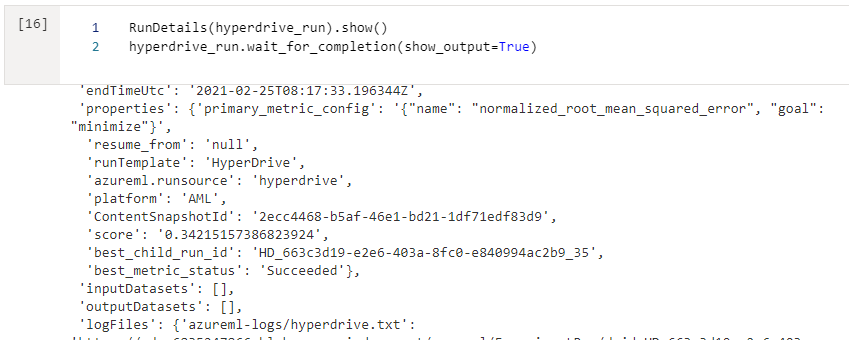
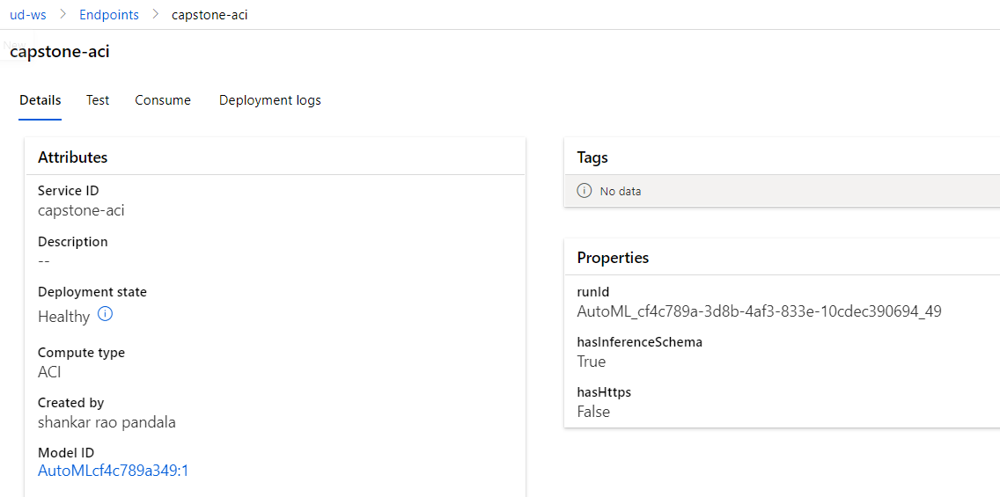

# Predicting resale value of a BMW car

This dataset is taken from kaggle from this location [Dataset Link](https://www.kaggle.com/adityadesai13/used-car-dataset-ford-and-mercedes?select=bmw.csv)

Objective of this project is to find out the resale value of a BMW car. To achive this objective, we are using regression techniques to predict the price of the car learning from the past data which is training data. 

We will try 2 approaches:

    1. AutoML
    2. HyperDrive

In the first approach we will use azure AutoML capability to figure out best model to predict the car price and in the later approach we use the traditional hyperparameter tuning approach using HyperDrive functionality of AzureML

Which ever approach gives us the best model will be deployed to ACI and tested with a sample json payload.

Architecture of the project:


## Project Set Up and Installation
This can be cloned to AzureML workspace and run the notebooks without much changes. One small prerequisite is data is uploaded manually to the datasets and consumed from the registered datasets in instead of getting it from the weburl everytime. Data file is available in the git repo which be uploaded to create a dataset. Remaining all other things will be created automatically when we run the notebook.

## Dataset

### Overview
This dataset is taken from kaggle from this location [Dataset Link](https://www.kaggle.com/adityadesai13/used-car-dataset-ford-and-mercedes?select=bmw.csv)
This is a datasets of cars that are resold.

Dataset contains 10,781 Observations and 9 columns.

Target Variable:
- price (This is the resale price what needs to be predicted)
Distribution of price 


Features of the data set:
- model
- year
- transmission
- mileage
- fuelType
- tax
- mpg
- engineSize

Here is the sample data:
|model    |year|price|transmission|mileage|fuelType|tax|mpg |engineSize|
|---------|----|-----|------------|-------|--------|---|----|----------|
| 5 Series|2014|11200|Automatic   |67068  |Diesel  |125|57.6|2         |
| 6 Series|2018|27000|Automatic   |14827  |Petrol  |145|42.8|2         |
| 5 Series|2016|16000|Automatic   |62794  |Diesel  |160|51.4|3         |
| 1 Series|2017|12750|Automatic   |26676  |Diesel  |145|72.4|1.5       |
| 7 Series|2014|14500|Automatic   |39554  |Diesel  |160|50.4|3         |


### Task
Objective of this project is to find out the resale value of a BMW car. To achive this objective, we are using regression techniques to predict the price of the car learning from the past data which is training data. 

### Access

Dataset is uploaded to the registered datasets **using GUI** and getting accessed in the workspace as below

```
from azureml.core import Dataset
dataset_name = 'bmw_cars'

# Get a dataset by name
bmw_cars = Dataset.get_by_name(workspace=ws, name=dataset_name)

# Load a TabularDataset into pandas DataFrame
df = bmw_cars.to_pandas_dataframe()
df.head()
```

## Automated ML

AutoML Settings:
- experiment_timeout_minutes is set to 30 Minutes to limit the resource usage
- max_concurrent_iterations is set to run 10 parallel runs
- primary_metric is defined as ```normalized_root_mean_squared_error``` as it the suitable metric for regression problems
- n_cross_validations is set to 5 to avoid overfitting

- compute_target=cluster_name which created in the notebook
- task = "regression", The task that we need to preform
- training_data=bmw_cars, The dataset we need to use
- label_column_name="price", The target variable we need to predict
- enable_early_stopping= True, To enable stopping if the models results are not improving with certain criteria
- featurization= 'auto', To let the AutoMl choose the feature encoding techniques that it can use
- enable_voting_ensemble= True, To enable whether it can build ensemble models or not

```
automl_settings = {
    "experiment_timeout_minutes": 30,
    "max_concurrent_iterations": 10,
    "primary_metric" : 'normalized_root_mean_squared_error',
    "n_cross_validations": 5
}
automl_config = AutoMLConfig(compute_target=cluster_name,
                             task = "regression",
                             training_data=bmw_cars,
                             label_column_name="price", 
                             enable_early_stopping= True,
                             featurization= 'auto',
                             enable_voting_ensemble= True,
                             **automl_settings
                            )
```

### Results

Below is the some of models ran by AutoML


Apart from trying mutiple algoritms. I would also do feature engineering to derive meaning features from exsting features that can help improve the model

Here is the screenshot of bestmodel:


Here is the screenshot of RunDetails:



## Hyperparameter Tuning
*TODO*: What kind of model did you choose for this experiment and why? Give an overview of the types of parameters and their ranges used for the hyperparameter search

RandomForest algorithm is choosen to build model with hyperparameters. Below are the parameters choosen

```
parameter_sampling = RandomParameterSampling(
                    {
                        "--n_estimators":choice(25,50,75,100),
                        "--max_features":choice(2,3,4,5),
                        "--max_depth":choice(2,3,4,5),
                        "--min_samples_split":choice(25,50,75,100) 
                    }
)
```
These are the very important hyperparameters for a randomforest model.

### Results

Best hyperdrive model is below:

Other models with different parameters:

Hyperdrive Run Details:



## Model Deployment


Deployed model is Stackensemble model from the AutoML runs which has a meta learner of ElasticnetCV
Other parameters of Stackensemble can be seen in the below picture

In real-time endpoints we can see the endpoint status is healthy


The REST endpoint for the deployed model is : [REST end-point](http://746accc7-209b-43df-b840-d0bb052f1a53.westus2.azurecontainer.io/score)

No key is required as endpoint is created pulic

Below is the code to query sample request using python
```
import urllib.request
import json
import os
import ssl

def allowSelfSignedHttps(allowed):
    # bypass the server certificate verification on client side
    if allowed and not os.environ.get('PYTHONHTTPSVERIFY', '') and getattr(ssl, '_create_unverified_context', None):
        ssl._create_default_https_context = ssl._create_unverified_context

allowSelfSignedHttps(True) # this line is needed if you use self-signed certificate in your scoring service.

data = {
    "data":
    [
        {
            'model': "example_value",
            'year': "0",
            'transmission': "example_value",
            'mileage': "0",
            'fuelType': "example_value",
            'tax': "0",
            'mpg': "0",
            'engineSize': "0",
        },
    ],
}

body = str.encode(json.dumps(data))

url = 'http://746accc7-209b-43df-b840-d0bb052f1a53.westus2.azurecontainer.io/score'
api_key = '' # Replace this with the API key for the web service
headers = {'Content-Type':'application/json', 'Authorization':('Bearer '+ api_key)}

req = urllib.request.Request(url, body, headers)

try:
    response = urllib.request.urlopen(req)

    result = response.read()
    print(result)
except urllib.error.HTTPError as error:
    print("The request failed with status code: " + str(error.code))

    # Print the headers - they include the requert ID and the timestamp, which are useful for debugging the failure
    print(error.info())
    print(json.loads(error.read().decode("utf8", 'ignore')))
```

## Screen Recording
Link to a screen recording of the project in action. The screencast demonstrates:
- A working model
- Demo of the deployed  model
- Demo of a sample request sent to the endpoint and its response

[Link to the demo](https://youtu.be/Hk3u7XgCj2s)

## Standout Suggestions
We are only tuning hyperparameters of only 1 algorithm. Instead if we can tune multiple alogorithms and do a stack enseble we might get a chance to improve the model better than hyperdrive
